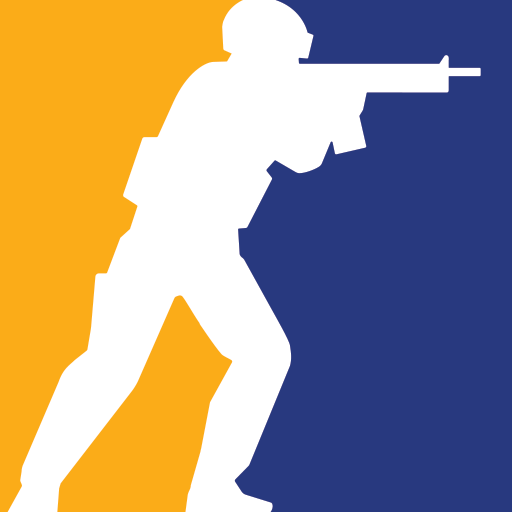

  

<h2 align="center">Rodopoulos | Developer</h2>

From Brazil 🇧🇷

---

## About Me
- Development in **C# for Counter-Strike 2 plugins**  
- Development in **SourcePawn for Counter-Strike: Global Offensive plugins**  
- Experience with **Python** for Discord bots and automation  
- Focused on gaming servers, community building, and custom systems  

---

## Technologies & Tools

  

  
  

---

## Featured Projects
- **CS2 Plugins (C#)** – gameplay mechanics, server systems, and integrations  
- **CSGO Plugins (SourcePawn)** – VIP systems, match tools, custom features  
- **Discord Bots (Python)** – verification, automation, utilities  

---

## GitHub Stats

  
  

---

## Connect
- **Discord (personal):** Rodopoulos  
- **Discord (Nexora Network – CS2 servers):** [Join here](https://discord.gg/UM4FJPVc6k)  
- **GitHub:** [Rodopoulos](https://github.com/rodopoulos1)  

---

